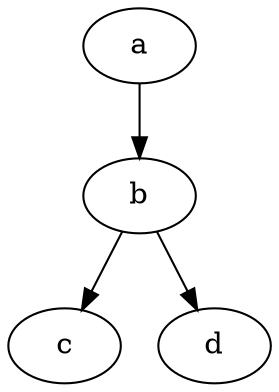

# Markdown学习01
this is a new day that I learn **Markdown**

> 引用文本：Markdown is a text formatting syntax insipired

## 语法指导
### 普通内容
这段内容展示了在内容里一些小的格式比如：
- **加粗** - `**加粗**`
- *倾斜* -  `*倾斜*`
- ~~删除线~~-`~~删除线~~`
- `code标记`-``code 标记``
- [超级链接](http://github.com)-`[超级链接](http://github.com)`
- [qqqqer@outlook.com](mailto:qqqqer@outlook.com)-`[qqqqer@outlook.com](mailto:qqqqer@outlook.com)`

### 提及用户
@Kstephen ... 通过 @ 可以在发帖和回帖里面提及用户，信息提交以后被提及的用户会收到系统通知，以便他来关注这个帖子或回帖。
>note:
>1.@用户名之后需要有一个空格
>2.新手没有@的功能权限

### 表情符号 Emoji
支持大部分标准的表情符号，可通过输入法直接输入，也可以手动输入字符格式。欢迎通过快捷键`Ctrl+/`自动完成进行输入，并在个人设置中[设置常用表情](https://hacpai.com/settings/function)。
#### 一些表情例子
:smile: :laughing: :dizzy_face: :sob: :cold_sweat: :sweat_smile:  :cry: :triumph: :heart_eyes: :relaxed:
:+1: :-1: :100: :clap: :bell: :gift: :question: :bomb: :heart: :coffee: :cyclone: :bow: :kiss: :pray: :anger:
### 大标题 -Heading 3
你可以使用H1-H6，使用 ##（空格）打头
>NOTE:别忘了# 后面需要有空格

#### H4
##### H5
###### H6
### 图片

```


```

支持直接复制上传 :)
### 代码块
##### 普通

```
*emphasize* **strong**
```


| header 1 | header 3 |
| -------- | -------- |
| cell 1   | cell 2   |
| cell 3   | cell 4   |
| cell 5   | cell 6   |


### 数学公式
$$a^2 +b^2=\color{red}c^2$$

### 流程图
```flow

st=>start: Start
op=>operation: Your Operation
cond=>condition: Yes or No?
e=>end

st->op->cond
cond(yes)->e
cond(no)->op
```
```flow

st=>start: BEGIN
op=>operation:  Show Time!
cond=>condition: OK?
e=>end: Good done!

st->op->cond
cond(yes)->e
cond(no)->op
```

<!-- @import "[TOC]" {cmd="toc" depthFrom=1 depthTo=6 orderedList=false} -->

code

```sequence{theme="hand"}
Dabai->Heitu:Hello
Note right of Heitu:Heitu think\nabout it
Heitu-->Dabai:how are you?
Dabai->>Heitu:I am good,thanks!

```
@import "1.jpg"
@import "1.jpg" {width="300px" height="200px" title="nihao" alt="我的 alt"}
@import "https://raw.githubusercontent.com/shd101wyy/markdown-preview-enhanced/master/LICENSE.md"
 d |  b|d
--|---|--
a  | d
a  |  a |  a
