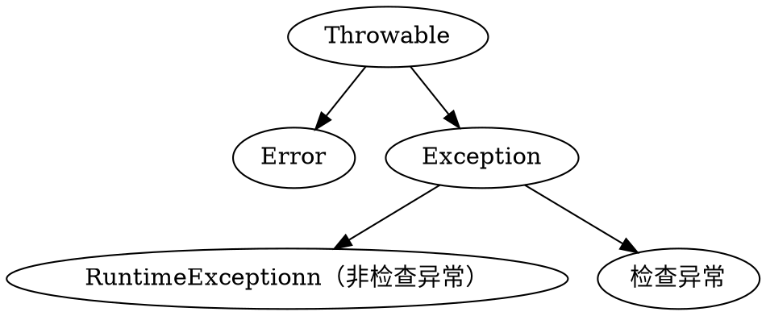

# 异常

```dot
digraph{
Throwable ->Error
Throwable ->Exception
Exception->RuntimeExceptionn（非检查异常）
Exception->检查异常
}
```
```java
try{
  ....
}catch(Exception e){//子类在前
  ....
}catch(Exception2 e){//父类在后
   ...
}...n个catch块...{
}
```
